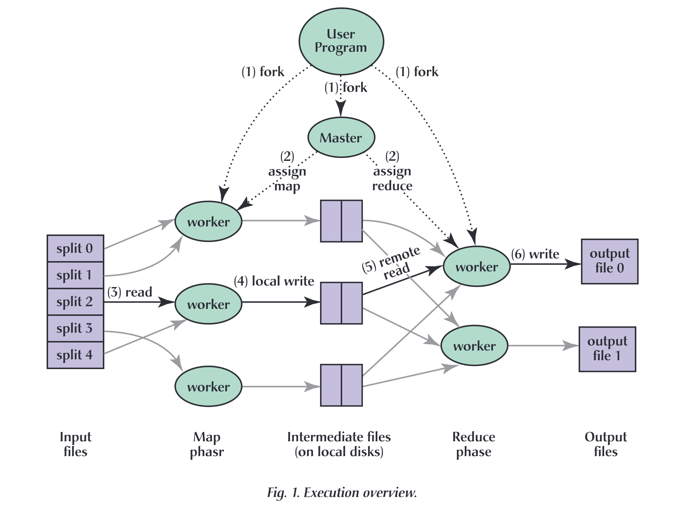
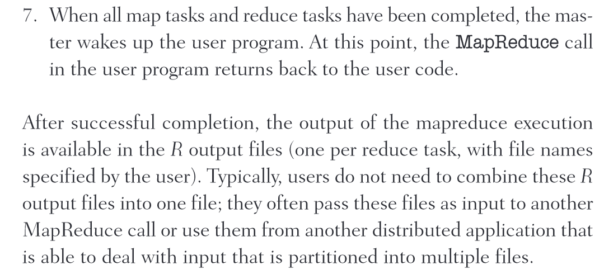

# (01/2008) MapReduce: simplified data processing on large clusters

|                                                                                                                                                                                                                                                                                                                                                                                                                                                                                                                                                                                                                                                                                                                                                                                                                                              |
| -------------------------------------------------------------------------------------------------------------------------------------------------------------------------------------------------------------------------------------------------------------------------------------------------------------------------------------------------------------------------------------------------------------------------------------------------------------------------------------------------------------------------------------------------------------------------------------------------------------------------------------------------------------------------------------------------------------------------------------------------------------------------------------------------------------------------------------------- |
| **期刊: Communications of the ACM**（发表日期:**01/2008**）**作者:**Jeffrey Dean; Sanjay Ghemawat                                                                                                                                                                                                                                                                                                                                                                                                                                                                                                                                                                                                                                                                                                                 |
| \*\*DOI : \*\*[10.1145/1327452.1327492](https://doi.org/10.1145/1327452.1327492)                                                                                                                                                                                                                                                                                                                                                                                                                                                                                                                                                                                                                                                                                                                                                             |
| \*\*摘要: \*\**MapReduce is a programming model and an associated implementation for processing and generating large datasets that is amenable to a broad variety of real-world tasks. Users specify the computation in terms of a map and a reduce function, and the underlying runtime system automatically parallelizes the computation across large-scale clusters of machines, handles machine failures, and schedules inter-machine communication to make efficient use of the network and disks. Programmers find the system easy to use: more than ten thousand distinct MapReduce programs have been implemented internally at Google over the past four years, and an average of one hundred thousand MapReduce jobs are executed on Google's clusters every day, processing a total of more than twenty petabytes of data per day.* |
| \*\*期刊分区: \*\*undefined                                                                                                                                                                                                                                                                                                                                                                                                                                                                                                                                                                                                                                                                                                                                                                                                                      |
| \*\*原文PDF链接: \*\*[Dean 和 Ghemawat - 2008 - MapReduce simplified data processing on large clu.pdf](zotero://open-pdf/0_UEA45RNH)                                                                                                                                                                                                                                                                                                                                                                                                                                                                                                                                                                                                                                                                                                              |
| \*\*笔记创建日期: \*\*2023/10/9 下午3:27:49                                                                                                                                                                                                                                                                                                                                                                                                                                                                                                                                                                                                                                                                                                                                                                                                          |

## 📚文章背景

<a class="internal-link" href="zotero://note/u/3FIF5M4P/" zhref="zotero://note/u/3FIF5M4P/" ztype="znotelink" class="internal-link">写作背景</a>

> 写作背景
>
> \" alt="\" /> (<a href="zotero://select/library/items/MUH7F2C2">Dean 和 Ghemawat, 2008</a>)
>
> Referred in <a class="internal-link" href="zotero://note/u/7DTXN3FC/?ignore=1&#x26;line=3" zhref="zotero://note/u/7DTXN3FC/?ignore=1&#x26;line=3" ztype="znotelink" class="internal-link">(01/2008) MapReduce: simplified data processing on large clusters</a>

<a class="internal-link" href="zotero://note/u/BHI8RWUB/" zhref="zotero://note/u/BHI8RWUB/" ztype="znotelink" class="internal-link">研究背景</a>

> 研究背景
>
> 🔤在我们开发 MapReduce 之前，作者和 Google 的许多其他人实施了数百种特殊用途计算，这些计算处理大量原始数据（例如爬行文档、Web 请求日志等），以计算各种派生数据，例如例如倒排索引、Web 文档图形结构的各种表示、每个主机抓取的页面数量的摘要以及给定日期中最频繁查询的集合。大多数此类计算在概念上都很简单。然而，输入数据通常很大，计算必须分布在数百或数千台机器上才能在合理的时间内完成。如何并行计算、分布数据、处理故障等问题，用大量复杂的代码来处理这些问题，掩盖了原本简单的计算🔤
>
> <a href="zotero://open-pdf/library/items/UEA45RNH?page=1&#x26;annotation=MK8SK3NA">“Prior to our development of MapReduce, the authors and many others at Google implemented hundreds of special-purpose computations that process large amounts of raw data, such as crawled documents, Web request logs, etc., to compute various kinds of derived data, such as inverted indices, various representations of the graph structure of Web documents, summaries of the number of pages crawled per host, and the set of most frequent queries in a given day. Most such computations are conceptually straightforward. However, the input data is usually large and the computations have to be distributed across hundreds or thousands of machines in order to finish in a reasonable amount of time. The issues of how to parallelize the computation, distribute the data, and handle failures conspire to obscure the original simple computation with large amounts of complex code to deal with these issues”</a> (<a href="zotero://select/library/items/MUH7F2C2">Dean 和 Ghemawat, 2008</a>)
>
> Referred in <a class="internal-link" href="./(01-2008)-MapReduce--simplified-data-processing-on-large-clusters-P4YGNUSB.md" zhref="zotero://note/u/P4YGNUSB/?ignore=1&#x26;line=10" ztype="znotelink" class="internal-link">(01/2008) MapReduce: simplified data processing on large clusters</a>

## 🧩可行性

<a class="internal-link" href="zotero://note/u/ADFT34KA/" zhref="zotero://note/u/ADFT34KA/" ztype="znotelink" class="internal-link">研究可行性</a>

> 研究可行性
>
> 🔤我们的抽象受到 Lisp 和许多其他函数式语言中存在的映射和归约原语的启发。我们意识到，我们的大多数计算涉及对输入中的每个逻辑记录应用映射操作，以计算一组中间键/值对，然后对共享相同键的所有值按顺序应用归约操作适当地组合派生数据。我们使用具有用户指定的映射和归约操作的功能模型，使我们能够轻松并行化大型计算，并使用重新执行作为容错的主要机制。🔤
>
> <a href="zotero://open-pdf/library/items/UEA45RNH?page=1&#x26;annotation=SBJF7GIZ">“Our abstraction is inspired by the map and reduce primitives present in Lisp and many other functional languages. We realized that most of our computations involved applying a map operation to each logical record’ in our input in order to compute a set of intermediate key/value pairs, and then applying a reduce operation to all the values that shared the same key in order to combine the derived data appropriately. Our use of a functional model with user-specified map and reduce operations allows us to parallelize large computations easily and to use reexecution as the primary mechanism for fault tolerance.”</a> (<a href="zotero://select/library/items/MUH7F2C2">Dean 和 Ghemawat, 2008</a>)
>
> Referred in <a class="internal-link" href="./(01-2008)-MapReduce--simplified-data-processing-on-large-clusters-P4YGNUSB.md" zhref="zotero://note/u/P4YGNUSB/?ignore=1&#x26;line=-1" ztype="znotelink" class="internal-link">(01/2008) MapReduce: simplified data processing on large clusters</a>

## 🔬实现方法

### 模型实现

<a class="internal-link" href="zotero://note/u/M9YRSMY9/" zhref="zotero://note/u/M9YRSMY9/" ztype="znotelink" class="internal-link">简述实现方式</a>

> 简述实现方式
>
> 🔤Map 由用户编写，接受一个输入对并生成一组中间键/值对。 MapReduce 库将与同一中间键 I 关联的所有中间值组合在一起，并将它们传递给reduce 函数。 reduce 函数也由用户编写，接受中间键 I 和该键的一组值。它将这些值合并在一起以形成可能更小的值集。通常每次reduce 调用仅产生零或一个输出值。中间值通过迭代器提供给用户的reduce函数。这使我们能够处理太大而无法容纳在内存中的值列表。🔤
>
> <a href="zotero://open-pdf/library/items/UEA45RNH?page=1&#x26;annotation=TC3F89CH">“Map, written by the user, takes an input pair and produces a set of intermediate key/value pairs. The MapReduce library groups together all intermediate values associated with the same intermediate key I and passes them to the reduce function. The reduce function, also written by the user, accepts an intermediate key I and a set of values for that key. It merges these values together to form a possibly smaller set of values. Typically just zero or one output value is produced per reduce invocation. The intermediate values are supplied to the user’s reduce function via an iterator. This allows us to handle lists of values that are too large to fit in memory.”</a> (<a href="zotero://select/library/items/MUH7F2C2">Dean 和 Ghemawat, 2008</a>)
>
> Referred in <a class="internal-link" href="./(01-2008)-MapReduce--simplified-data-processing-on-large-clusters-P4YGNUSB.md" zhref="zotero://note/u/P4YGNUSB/?ignore=1&#x26;line=11" ztype="znotelink" class="internal-link">(01/2008) MapReduce: simplified data processing on large clusters</a>

<a class="internal-link" href="zotero://note/u/YH4AP6M9/" zhref="zotero://note/u/YH4AP6M9/" ztype="znotelink" class="internal-link">实现细节 (Dean 和 Ghemawat, 2008, p. 3)</a>

> 实现细节  (<a href="zotero://select/library/items/MUH7F2C2">Dean 和 Ghemawat, 2008</a>)
>
> \" alt="\" />
>
>  (<a href="zotero://select/library/items/MUH7F2C2">Dean 和 Ghemawat, 2008</a>)
>
> MapReduce 的工作流：
>
> *   将输入文件分成 **M** 个小文件(split)，每个文件的大小大概 16M-64M（由用户参数控制），在集群中启动 MapReduce 实例，其中`fork`
>
>     一个 Master 和多个 Worker；\[1]
>
> *   由 Master 分配任务，将
>
>     `Map`与`Reduce`任务分配给可用的 Worker\[2]；
>
> *   `Map`Worker 读取文件\[3]，执行用户自定义的 map 函数，输出 中间值key/value 对，缓存在内存中；
>
> *   内存中的 (key, value) 对通过
>
>     `partitioning function()`例如`hash(key) mod R`分为**R**个 regions（保证相同key的键值对在一个分区），然后写入磁盘(local disk)\[4]。完成之后，把这些文件的地址回传给 Master，然后 Master 把这些位置传给`Reduce`Worker；
>
> *   `Reduce`Worker 收到数据存储位置信息后，使用 RPC(Remote Procedure Call远程过程调用协议) 从`Map`Worker 所在的磁盘读取这些数据\[5]，根据 key 进行排序，并将同一 key 的所有数据分组聚合在一起（**由于许多不同的 key 值会映射到相同的 Reduce 任务上，因此必须进行排序。如果中间数据太大无法在内存中完成排序，那么就要在外部进行排序**）；
>
> *   `Reduce`Worker 将分组后的值传给用户自定义的 reduce 函数，输出追加到所属分区的输出文件中；
>
> *   当所有的 Map 任务和 Reduce 任务都完成后，Master 向用户程序返回结果；
>
> MapReduce对输出文件的处理：
>
> 通常情况下，用户并不需要将 R 个输出文件合并成一个文件；他们通常会将这些文件作为输入传递给另一个 MapReduce 调用，或者从另一个能够处理分割成多个文件的输入的分布式应用程序中使用这些文件。
>
> Referred in <a class="internal-link" href="./(01-2008)-MapReduce--simplified-data-processing-on-large-clusters-P4YGNUSB.md" zhref="zotero://note/u/P4YGNUSB/?ignore=1&#x26;line=-1" ztype="znotelink" class="internal-link">(01/2008) MapReduce: simplified data processing on large clusters</a>

### 容错实现

<a class="internal-link" href="zotero://note/u/6YCRLMJ3/" zhref="zotero://note/u/6YCRLMJ3/" ztype="znotelink" class="internal-link">处理worker错误</a>

> ### 处理worker错误
>
> *   master通过周期地向worker发送ping指令来确保worker处于存活状态，对于没有回应ping指令的worker，master会将该worker标记为
>
>     **failed**
>
> *   在failed worker执行中的 Map 或 Reduce 任务会被重置为idle状态，可被其他存活worker接收。
>
> *   在failed worker上已经执行完成的Map任务会被再次执行，因为其输出结果存储在failed worker本地磁盘中，如果failed worker在local write之前就挂掉，那么该数据无法被读取，因此需要从新执行。而Reduce任务不会被再次执行，因为其输出结果存储在全局文件系统中。
>
> 对于failed worker任务处理总结下来就是：
>
> | \\任务状态状态\\ | \\Map任务\\ | \\Reduce任务\\ |
> | ---------------------------------------------------------------------------------------------------------------- | --------------------------------------------------------------------------------------------------------------- | ------------------------------------------------------------------------------------------------------------------ |
> | 执行中                                                                                                              | 设置为idle                                                                                                         | 设置为idle                                                                                                            |
> | 执行结束                                                                                                             | 从新执行                                                                                                            | 不用处理                                                                                                               |
>
> 对于worker A 执行的Map任务随后被worker B 执行，那么所有执行Reduce任务的worker都会接到通知：还没有从worker A读取数据的reduce worker 将会从worker B 上读取数据。
>
> Referred in <a class="internal-link" href="zotero://note/u/7DTXN3FC/?ignore=1&#x26;line=8" zhref="zotero://note/u/7DTXN3FC/?ignore=1&#x26;line=8" ztype="znotelink" class="internal-link">(01/2008) MapReduce: simplified data processing on large clusters</a>

<a class="internal-link" href="./(01-2008)-MapReduce--simplified-data-processing-on-large-clusters-P4YGNUSB.md" zhref="zotero://note/u/P4YGNUSB/" ztype="znotelink" class="internal-link">处理错误时的语义处理</a>

> #### 处理错误时的语义处理
>
> 用户提供的映射（map）和归约（reduce）操作是其输入值的确定性函数时，分布式实现将生成与整个程序的非故障顺序执行所产生的相同输出。
>
> 为了实现这个特性，我们依赖于映射和归约任务输出的原子提交。每个正在进行的任务将其输出写入私有临时文件。一个归约任务产生一个这样的文件，而一个映射任务产生 R 个这样的文件（每个归约任务一个）。当一个映射任务完成时，工作节点向主节点发送消息，并在消息中包含这些临时文件的名称。如果主节点接收到一个已经完成的映射任务的完成消息，它将忽略该消息。否则，它将记录 R 个文件的名称在主节点的数据结构中。当一个归约任务完成时，归约工作节点将其临时输出文件原子性地重命名为最终输出文件。如果相同的归约任务在多个机器上执行，那么对于相同的最终输出文件将执行多个重命名调用。我们依赖底层文件系统提供的原子重命名操作来保证最终文件系统状态仅包含一个归约任务执行产生的数据。我们绝大部分的映射和归约操作是确定性的，而且在这种情况下，我们的语义等效于顺序执行，这使得程序员很容易推断出程序的行为。、
>
> 当映射和/或归约操作是非确定性的时，我们提供了较弱但仍然合理的语义。在存在非确定性操作的情况下，特定归约任务 R 的输出等价于非确定性程序的顺序执行产生的 R 的输出。然而，不同归约任务 F 的输出可能对应于由非确定性程序的不同顺序执行产生的 R 的输出。
>
> Referred in <a class="internal-link" href="zotero://note/u/7DTXN3FC/?ignore=1&#x26;line=9" zhref="zotero://note/u/7DTXN3FC/?ignore=1&#x26;line=9" ztype="znotelink" class="internal-link">(01/2008) MapReduce: simplified data processing on large clusters</a>

### 模型优化

<a class="internal-link" href="zotero://note/u/IM4HIF6A/" zhref="zotero://note/u/IM4HIF6A/" ztype="znotelink" class="internal-link">任务粒度（Task Granularity）</a>

> ### 任务粒度（Task Granularity）
>
> 之前在工作流中提到，输入文件被分为 M 个切片，而通过划分函数将存储在disk中的中间文件划分为 R 个区域。为了提升动态载入平衡能力以及加快 failed worker 的恢复，M 和 R 的值应当被设置地远大于worker machines数量。
>
> 但 M 和 R 的值越大越好，因为 master 会进行 O(M + R) 次的调度，同时master会在内存中存储 O(M * R) 状态值，因此 M 和 R 的值也会有一个界限（Bound）。
>
> R 的值通常由worker数量来决定，一个worker承担一个或多个region的reduce操作，产出一个单独的结果文件。用户通常决定的是 M 的值，实践中每一个独立的任务在 16MB ~ 64MB 输入数据时，能够最有效地实现局部性优化。而 R 的数量只需要是worker数量的小几倍就行了。
>
> 例如：M = 200000， R = 5000 ，2000 worker machines 来处理。
>
> Referred in <a class="internal-link" href="./(01-2008)-MapReduce--simplified-data-processing-on-large-clusters-P4YGNUSB.md" zhref="zotero://note/u/P4YGNUSB/?ignore=1&#x26;line=15" ztype="znotelink" class="internal-link">Workspace Note</a>
>
> Referred in <a class="internal-link" href="zotero://note/u/7DTXN3FC/?ignore=1&#x26;line=13" zhref="zotero://note/u/7DTXN3FC/?ignore=1&#x26;line=13" ztype="znotelink" class="internal-link">(01/2008) MapReduce: simplified data processing on large clusters</a>

<a class="internal-link" href="zotero://note/u/KYQ46U5V/" zhref="zotero://note/u/KYQ46U5V/" ztype="znotelink" class="internal-link">读取位置(locality)</a>

> ### 读取位置(locality)
>
> <a href="zotero://open-pdf/library/items/UEA45RNH?page=4&#x26;annotation=WY4DT687">“The MapReduce master takes the location information of the input files into account and attempts to schedule a map task on a machine that contains a replica of the corresponding input data.”</a> (<a href="zotero://select/library/items/MUH7F2C2">Dean 和 Ghemawat, 2008</a>) 🔤MapReduce master 考虑输入文件的位置信息，并尝试在包含相应输入数据副本的计算机上安排映射任务。🔤
>
> 为了节省带宽资源，MapReduce工作集群中输入数据通常存储在机器的本地磁盘中，在Map任务开始前，Master会考虑输入文件的位置信息，将尝试在包含输入数据的机器上执行Map任务。
>
> 如果上述方法行不通，Master也会考虑在存储输入文件机器附近的机器（例如，在与包含数据的机器处于同一交换机上工作的机器）执行Map任务。
>
> 因此MapReduce大部分的输入数据都是在本地读取的，不占用网络带宽。
>
> Referred in <a class="internal-link" href="./(01-2008)-MapReduce--simplified-data-processing-on-large-clusters-P4YGNUSB.md" zhref="zotero://note/u/P4YGNUSB/?ignore=1&#x26;line=15" ztype="znotelink" class="internal-link">Workspace Note</a>
>
> Referred in <a class="internal-link" href="zotero://note/u/7DTXN3FC/?ignore=1&#x26;line=14" zhref="zotero://note/u/7DTXN3FC/?ignore=1&#x26;line=14" ztype="znotelink" class="internal-link">(01/2008) MapReduce: simplified data processing on large clusters</a>

## 📜结论

MapReduce 编程模型一成功归因于几个原因。

首先，该模型易于使用，即使对于没有并行和分布式系统经验的程序员来说也是如此，因为它隐藏了并行化、容错、局部优化和负载平衡的细节。

其次，各种各样的问题可以很容易地表达为 MapReduce 计算。例如，MapReduce 用于为 Google 的生产网络搜索服务生成数据，用于排序、数据挖掘、机器学习和许多其他系统。

最后，我们开发了一种 MapReduce 实现，可以扩展到包含数千台机器的大型机器集群。该实现有效地利用了这些机器资源，因此适合用于解决 Google 遇到的许多大型计算问题。通过限制编程模型，我们可以轻松实现并行化和分布式计算，并使此类计算具有容错能力。

网络带宽是一种稀缺资源。因此，我们系统中的许多优化旨在减少通过网络发送的数据量：局部性优化允许我们从本地磁盘读取数据，并将中间数据的单个副本写入本地磁盘可以节省网络带宽。第三，冗余执行可用于减少缓慢机器的影响，并处理机器故障和数据丢失。

## 💡创新点

> Tips: 本文提出了什么<u>新的科学问题</u>，提出了什么<u>新的研究思路</u>，或提出了什么<u>新的研究工具</u>？

## 🤔思考

> Tips: 自己的想法（按照‘125’原则，<u>1个思路，2个表格，5个句式</u>：思考这篇文章能为自己未来带来怎么样的思路，不管是试验方法还是研究思路；学习这篇文章画的比较好的图标；总结写的好的5个句式，尝试模仿运用）
